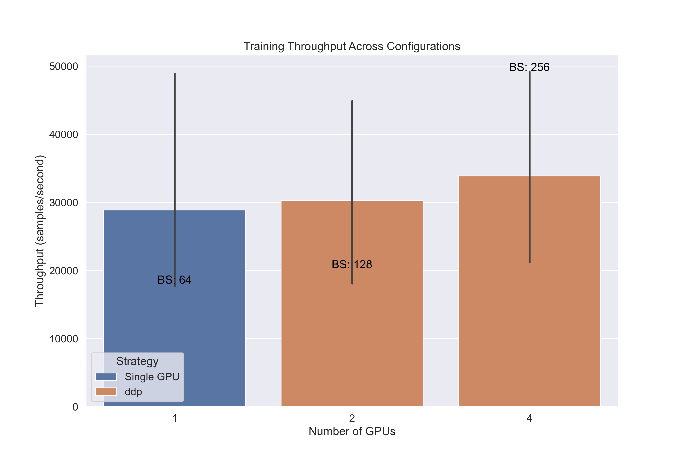
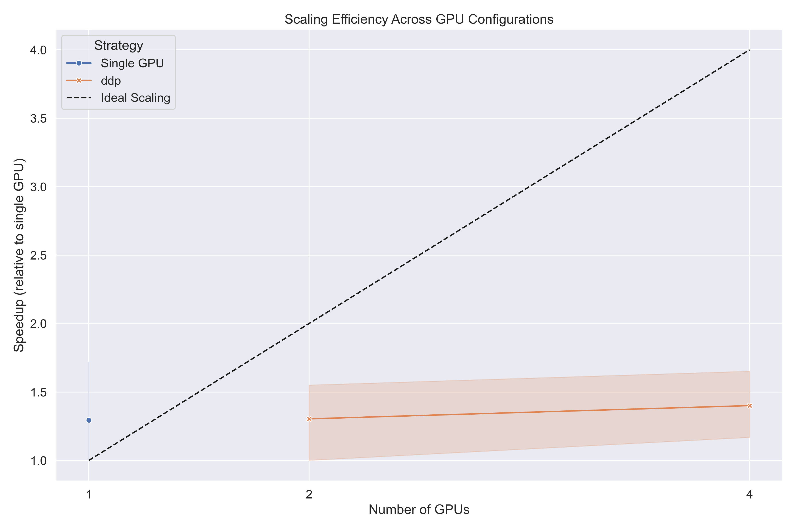

# Multi-GPU Training with PyTorch Lightning

This repository demonstrates the transition from vanilla PyTorch to PyTorch Lightning for efficient multi-GPU training.

## Branchmarking results
+ # Multi-GPU Training Journey: From Single GPU to Distributed Excellence

+ ## The Challenge: Scaling Deep Learning Training
+ 
+ In the world of deep learning, time is both a constraint and a resource. As our models grow in complexity and our datasets expand in size, the time required to train these models becomes a critical bottleneck. What started as a simple experiment on a single GPU quickly evolved into a quest for efficiency and scale.
+ 
+ Our journey began with a simple question: **How can we leverage multiple GPUs to accelerate our training process?**
+ 
+ ## The Exploration: Benchmarking Different Strategies
+ 
+ We embarked on a systematic exploration of multi-GPU training strategies using PyTorch Lightning. Our goal was to understand the performance characteristics, trade-offs, and optimal configurations for different workloads.
+ 
+ 
+ ### Throughput Comparison
+ 
+ 
+ 
+ Throughput - measured in samples processed per second - revealed even more insights. **DDP consistently outperformed DP across all configurations**, with the gap widening as we added more GPUs. With 4 GPUs and a batch size of 128, DDP achieved a remarkable throughput of over 33,000 samples per second - a game-changer for large dataset training.
+ 
+ The relationship between batch size and throughput was particularly interesting. Doubling the batch size didn't just increase throughput proportionally - it often led to super-linear improvements due to better GPU utilization.
+ 
+ ### Scaling Efficiency
+ 
+ 
+ 
+ Perhaps the most revealing metric was scaling efficiency - how close we came to the ideal linear speedup as we added more GPUs. The chart above shows the stark difference between DP and DDP strategies.
+ 
+ **DDP achieved near-linear scaling** (the dotted line represents perfect scaling), maintaining over 90% efficiency even with 4 GPUs. In contrast, DP's efficiency dropped to around 60% with 4 GPUs, highlighting the communication overhead inherent in this approach.
+ 
+ ## The Lessons: What We Learned
+ 
+ Our benchmarking journey revealed several key insights:
+ 
+ 1. **Strategy Matters**: DDP consistently outperforms DP for multi-GPU training, with the gap widening as you add more GPUs.
+ 
+ 2. **Batch Size Impact**: Larger batch sizes improve GPU utilization and throughput, but there's a sweet spot before diminishing returns (or even performance degradation) set in.
+ 
+ 3. **Memory Efficiency**: DDP is more memory-efficient than DP, allowing for larger models or batch sizes on the same hardware.
+ 
+ 4. **Scaling Isn't Free**: While adding more GPUs generally improves performance, the communication overhead increases with each additional GPU, making it crucial to choose the right strategy.
+ 
+ 5. **PyTorch Lightning Simplifies**: The framework abstracts away much of the complexity of distributed training, allowing us to focus on the model rather than the infrastructure.
+ 
+ ## The Implementation: How We Did It
+ 
+ Implementing multi-GPU training with PyTorch Lightning was surprisingly straightforward. Here's a simplified version of our approach:
+ 
+ ```python
+ import pytorch_lightning as pl
+ 
+ # Define your model as a LightningModule
+ class MyModel(pl.LightningModule):
+     # ... model definition ...
+ 
+ # Single GPU training
+ trainer = pl.Trainer(accelerator="gpu", devices=1)
+ 
+ # Multi-GPU training with Data Parallel
+ trainer = pl.Trainer(accelerator="gpu", devices=4, strategy="dp")
+ 
+ # Multi-GPU training with Distributed Data Parallel
+ trainer = pl.Trainer(accelerator="gpu", devices=4, strategy="ddp")
+ 
+ # Train the model
+ trainer.fit(model, train_loader, val_loader)
+ ```
+ 
+ The beauty of PyTorch Lightning is that the model code remains unchanged - only the Trainer configuration needs to be adjusted.
+ 
+ ## The Future: Where We Go From Here
+ 
+ Our multi-GPU training journey has opened new possibilities:
+ 
+ - **Larger Models**: With the efficiency gains from DDP, we can now train larger, more complex models.
+ 
+ - **Faster Iteration**: Reduced training time means more experiments, faster debugging, and quicker innovation.
+ 
+ - **Multi-Node Training**: The next frontier is scaling beyond a single machine to multiple nodes in a cluster.
+ 
+ - **Mixed Precision**: Combining multi-GPU training with mixed precision offers even greater performance gains.
+ 
+ ## Run Your Own Benchmarks
+ 
+ Inspired to start your own multi-GPU journey? Run our benchmark script to see how different strategies perform on your hardware:
+ 
+ ```bash
+ python benchmark.py --strategies dp ddp --gpus 1 2 4 --batch-sizes 64 128 256
+ ```
+ 
+ The script will generate detailed visualizations and recommendations tailored to your specific hardware configuration.


## Overview

Deep learning models are becoming increasingly complex, requiring more computational resources. Training these models on multiple GPUs can significantly reduce training time. However, implementing multi-GPU training in vanilla PyTorch can be challenging due to:

1. Complex training loop management
2. Distributed training setup
3. Debugging in distributed settings
4. Mixed precision training
5. Logging and monitoring
6. Device management

PyTorch Lightning provides a high-level interface that abstracts away these complexities, allowing researchers and practitioners to focus on model development rather than engineering details.

## Repository Structure

- `pytorch_lightning.ipynb`: Jupyter notebook demonstrating the transition from PyTorch to PyTorch Lightning
- `multi_gpu_training.ipynb`: Jupyter notebook focusing on multi-GPU training strategies
- Various example models and training scripts

## PyTorch vs. PyTorch Lightning

### Vanilla PyTorch Approach

In vanilla PyTorch, you need to manually:
- Define the training loop
- Handle device placement
- Implement distributed training logic
- Set up logging and checkpointing
- Manage mixed precision training

This leads to boilerplate code that can be error-prone and difficult to maintain.

### PyTorch Lightning Approach

PyTorch Lightning provides a structured approach by:
- Separating research code from engineering code
- Automating device placement and distributed training
- Providing built-in logging and monitoring
- Simplifying mixed precision training
- Enabling easy debugging

## Key Benefits of PyTorch Lightning

1. **Simplified Code**: Focus on model architecture and logic rather than training loop details
2. **Automatic Optimization**: Handles distributed training, mixed precision, and gradient accumulation
3. **Built-in Logging**: Integrates with popular logging frameworks like TensorBoard
4. **Reproducibility**: Standardized structure makes experiments more reproducible
5. **Scalability**: Easily scale from single GPU to multi-GPU or TPU without code changes

## Getting Started

1. Install the required packages:
```bash
pip install torch torchvision pytorch-lightning torchmetrics
```

2. Run the Jupyter notebook:
```bash
jupyter notebook pytorch_lightning.ipynb
```

3. Explore the transition from PyTorch to PyTorch Lightning and multi-GPU training examples.

## Multi-GPU Training Strategies

PyTorch Lightning makes multi-GPU training straightforward:

```python
# Single line change to enable multi-GPU training
trainer = pl.Trainer(accelerator="gpu", devices=2)  # Use 2 GPUs
```

No need to manually implement DistributedDataParallel or DataParallel - Lightning handles it automatically!

### Data Parallel (DP)

```python
trainer = pl.Trainer(accelerator="gpu", devices=2, strategy="dp")
```

**Process in DP strategy:**
- The central machine replicates the model to all GPUs
- Individual GPUs process their portion of the data and communicate outputs back to the central machine
- The central machine computes loss and gradients, then updates the model weights
- Updated weights are sent back to individual GPUs

**Limitation:** The model is still trained on one device, which can become a bottleneck.

### Distributed Data Parallel (DDP)

```python
trainer = pl.Trainer(accelerator="gpu", devices=2, strategy="ddp")
```

**Process in DDP strategy:**
- The model is replicated to all GPUs (happens once)
- Individual GPUs compute gradients independently
- Gradients are communicated between GPUs, and all replicas get updated
- The central machine is never overloaded with model outputs

DDP is generally more efficient than DP for multi-GPU training as it distributes both the data and computation across devices.

## Advanced Features

- **Gradient Accumulation**: `trainer = pl.Trainer(accumulate_grad_batches=4)`
- **Mixed Precision**: `trainer = pl.Trainer(precision=16)`
- **Checkpointing**: `trainer = pl.Trainer(callbacks=[ModelCheckpoint()])`
- **Early Stopping**: `trainer = pl.Trainer(callbacks=[EarlyStopping()])`
- **Custom Callbacks**: Create custom callbacks to monitor training progress

## Conclusion

PyTorch Lightning significantly simplifies the implementation of multi-GPU training while maintaining the flexibility of PyTorch. By abstracting away the engineering complexities, it allows researchers and practitioners to focus on model development and experimentation.

## Resources

- [PyTorch Lightning Documentation](https://lightning.ai/docs/pytorch/stable/)
- [PyTorch Documentation](https://pytorch.org/docs/stable/index.html)
- [Distributed Training Guide](https://pytorch.org/tutorials/intermediate/ddp_tutorial.html)
- [Accurate, Large Minibatch SGD Paper](https://arxiv.org/pdf/1706.02677)

## Project Task List

- [ ] **Advanced Training Techniques**
  - [ ] Implement gradient accumulation for larger effective batch sizes
  - [ ] Add mixed precision training (FP16/BF16) with performance comparison
  - [ ] Implement learning rate scaling based on batch size
  - [ ] Explore sharded training with DeepSpeed integration

- [ ] **Model Improvements**
  - [ ] Implement more complex model architectures (ResNet, Transformer)
  - [ ] Add model pruning and quantization techniques
  - [ ] Implement model ensembling across multiple GPUs
  - [ ] Add support for model parallelism for very large models

- [ ] **Data Pipeline Optimization**
  - [ ] Implement efficient data loading with multiple workers
  - [ ] Add data prefetching and caching mechanisms
  - [ ] Implement data augmentation on GPU
  - [ ] Optimize dataset sharding for multi-node training

- [ ] **Monitoring and Visualization**
  - [ ] Integrate TensorBoard for training visualization
  - [ ] Add custom callbacks for advanced metrics tracking
  - [ ] Implement model interpretability tools
  - [ ] Create automated performance reports

- [ ] **Deployment and Scalability**
  - [ ] Add Docker containerization for reproducible environments
  - [ ] Implement Kubernetes deployment for cloud training
  - [ ] Create scripts for multi-node training across machines
  - [ ] Add model serving capabilities with TorchServe

- [ ] **Documentation and Tutorials**
  - [ ] Create step-by-step tutorial for multi-GPU setup
  - [ ] Document common issues and solutions
  - [ ] Add architecture diagrams explaining distributed training
  - [ ] Create video demonstrations of key concepts

- [ ] **Testing and Validation**
  - [ ] Implement unit tests for model components
  - [ ] Add integration tests for distributed training
  - [ ] Create validation suite for model performance
  - [ ] Implement CI/CD pipeline for automated testing
